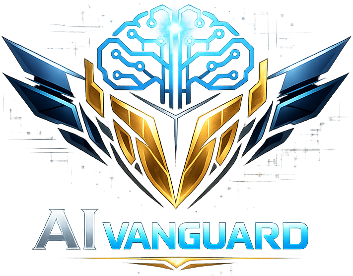

# AI VANGUARD

El ecosistema de inteligencia artificial que automatiza tu negocio.



---

## 🧩 Plataformas

| Plataforma | Descripción |
|---|---|
| **SYNDRA** | Automatización de contenido y marketing con IA |
| **INMOFLOW** | CRM inmobiliario con IA |
| **FLOWMIND** | Gestión financiera personal con IA |
| **CLOSER AI** | Centro de agentes IA para ventas |
| **SCOUTLEAGUE** | Plataforma de scouting futbolístico |

---

## 📁 Estructura del proyecto

```
ai-vanguard/
├── apps/
│   ├── web/          # Next.js 14 (App Router) - Landing page
│   └── api/          # NestJS - API backend
├── docker-compose.yml
├── .env.example
└── README.md
```

---

## ⚙️ Stack tecnológico

**Frontend:**
- Next.js 14+ (App Router)
- TailwindCSS
- Framer Motion
- TypeScript

**Backend:**
- NestJS
- TypeScript
- API modular

**Infraestructura:**
- Docker & Docker Compose

---

## 🚀 Inicio rápido

### Requisitos previos

- Node.js 20+
- npm o yarn
- Docker & Docker Compose (para producción)

### Desarrollo local

```bash
# 1. Clonar el repositorio
git clone <repo-url>
cd ai-vanguard

# 2. Copiar variables de entorno
cp .env.example .env

# 3. Instalar dependencias del frontend
cd apps/web
npm install

# 4. Iniciar el frontend en modo desarrollo
npm run dev
# → http://localhost:3000

# 5. (Opcional) En otra terminal, iniciar el backend
cd apps/api
npm install
npm run start:dev
# → http://localhost:4000
```

### Producción con Docker

```bash
# 1. Copiar variables de entorno
cp .env.example .env

# 2. Construir y levantar los contenedores
docker-compose up -d

# → Frontend: http://localhost:3000
# → API:      http://localhost:4000
```

### Detener contenedores

```bash
docker-compose down
```

---

## 🖼️ Logo

Coloca el logo de AI Vanguard en:

```
apps/web/public/images/logo.png
```

---

## 📡 API Endpoints

| Método | Ruta | Descripción |
|---|---|---|
| GET | `/api/v1/health` | Estado del servicio |
| GET | `/api/v1/platforms` | Lista de plataformas |

---

## 📄 Licencia

Todos los derechos reservados © AI Vanguard 2026.
